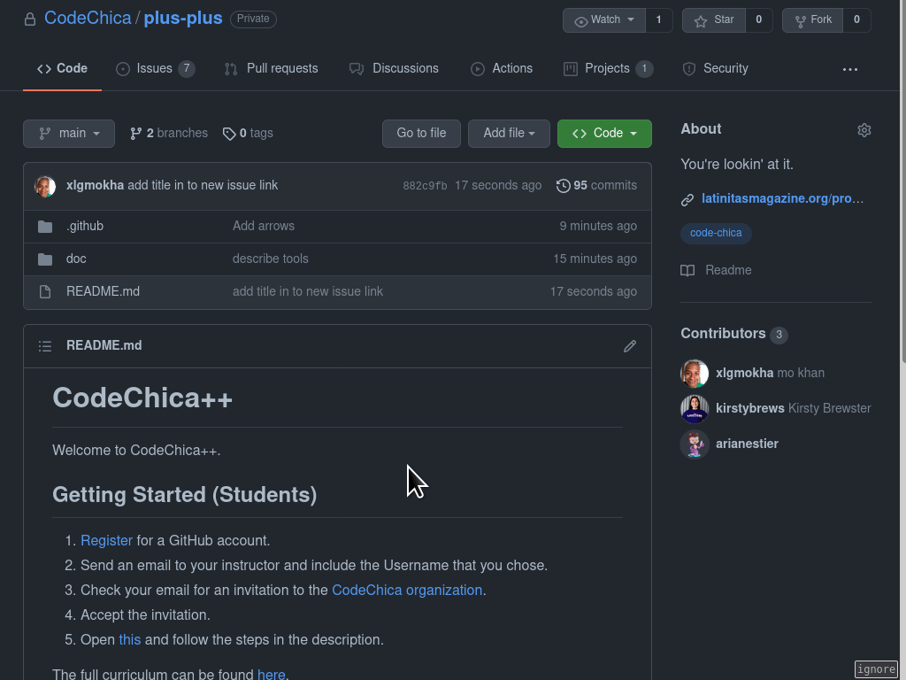
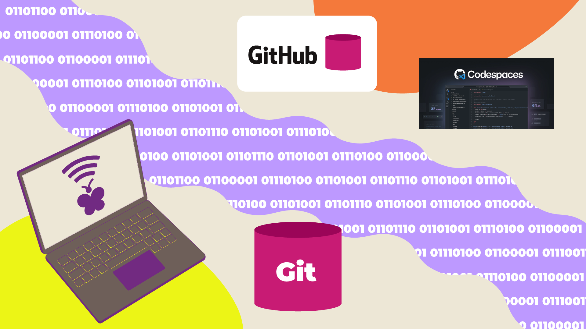

# GitHub

[GitHub][github] is a website that lets us save our [git](./git.html) repositories for free.
It is the largest code hosting platform on the planet. It's a great place to
create a backup of your code and collaborate with other coders.

We'll be using our [CodeChica organization on GitHub][organization] to host our
code, provide development environments via [Codespaces](#codespaces), facilitate
[discussions][discussions] and [track our progress][curriculum].

<!-- ::TODO Video tour -->

[Register](https://github.com/signup), [learn more][github] or [complete the
learning paths][learning_paths].

## Issues

In this course, we'll be using [GitHub Issues](https://github.com/features/issues/) to help us track our progress.
You can always visit the [issues page](https://github.com/CodeChica/plus-plus/issues) to find the issue assigned to you.

Follow the steps below to create your first Issue.

1. [Open](https://github.com/CodeChica/plus-plus/issues/new/choose) in a new tab.
1. Click the "Get Started" button next to "Lesson 0x01"

## Codespaces

We use [Codespaces](https://github.com/codespaces) to make sure that everyone
has access to the tools and software that they need for this course
so that everyone can learn to code.

A [Codespace](https://github.com/codespaces) is a development environment
that is created just for you. You can think of it like it is your own
computer. When you create a Codespace it also comes with a bunch of tools
and software already installed. So you can focus on writing code instead of
figuring out how to install git, Linux, Ruby, Node.js etc.

### [Create my Codespace](https://docs.github.com/en/codespaces/developing-in-codespaces/creating-a-codespace#creating-a-codespace)



1. Open the [SparkleHub](https://github.com/codechica/SparkleHub) repo in a browser.
1. Click on "Code"
1. Click on "Codespaces"
1. Click on "New codespace"
1. Select "2 core"
1. Click on "Create codespace"
1. Click on "Open in VSCode"
1. Accept the project extensions
1. Be patient
1. Open a Terminal ("Terminal" -> "New Terminal")
1. Type `./script/server`
1. Open [http://localhost:3000/](http://localhost:3000/) in your web browser.

This is your copy of the final project that you are free to explore.
Take a look at the files in the directory [app/views](https://github.com/CodeChica/SparkleHub/blob/main/app/views/).

If you want to turn off the server press "Ctrl" + "c" in the terminal.

### [Delete my Codespace](https://docs.github.com/en/codespaces/developing-in-codespaces/deleting-a-codespace)

When you are finished with your Codespace it is a good idea to clean it up.

1. Open [Your codespaces](https://github.com/codespaces) in a web browser.
1. Click on the `...` menu on the right side.
1. Choose the "Delete" option.

### Help

[Try the troubleshooting guide](https://docs.github.com/en/codespaces/codespaces-reference/troubleshooting-your-codespace)
or [open a new question](https://github.com/CodeChica/plus-plus/discussions/categories/q-a) if you get stuck.

[curriculum]: https://github.com/CodeChica/plus-plus/issues/new/choose
[discussions]: https://github.com/CodeChica/plus-plus/discussions
[github]: https://lab.github.com/githubtraining/introduction-to-github
[organization]: https://github.com/CodeChica
[learning_paths]: https://lab.github.com/githubtraining/paths
