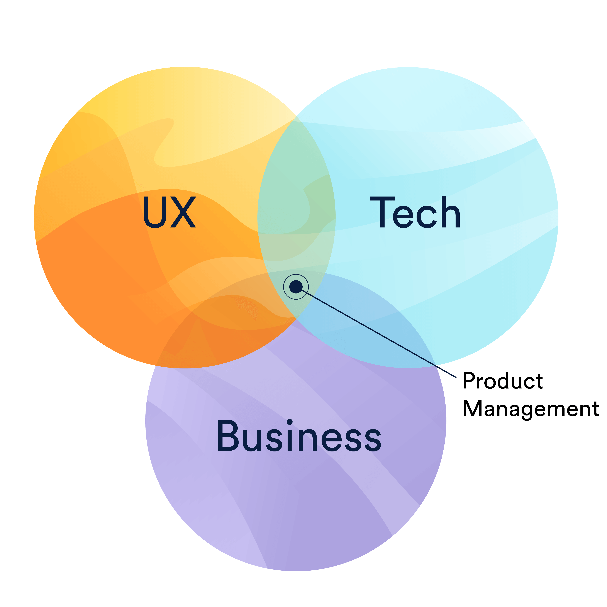
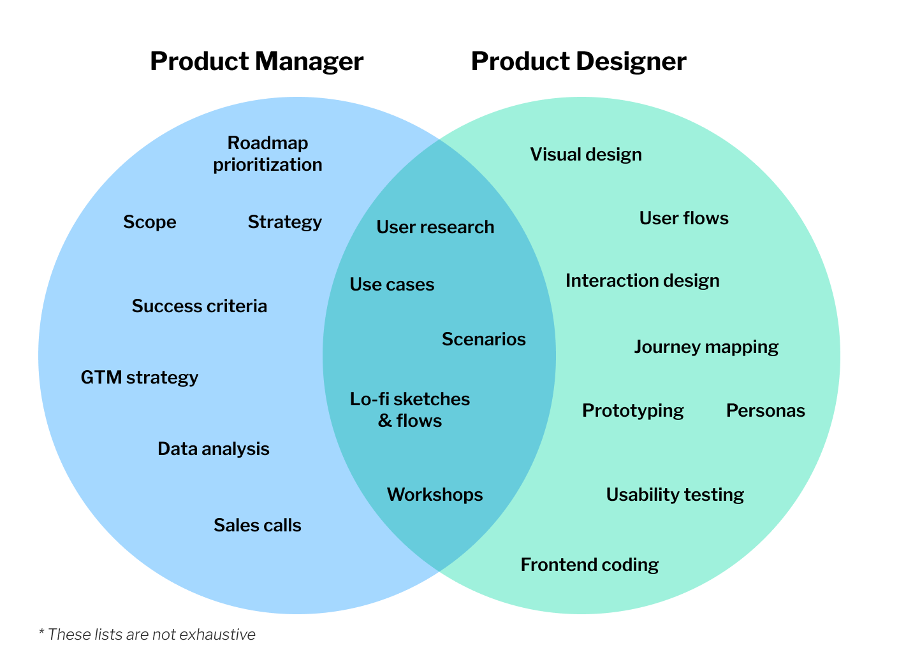

# 0x03 - Tech Roles Overview

In this lesson, you will explore an overview of product manager, designer and engineering roles in tech. 

By the end of this lesson:

* you will explore Product Manager and Designer roles in tech
* you will come up with an idea for a new feature
* you will create a wireframe for your feature idea as the designer, and a user story as the product manager

Now, you will get an overview of each of the tech roles! You'll also meet our Latinitas Code Chica++ Tech Role Personas – Diana, Elena and Paola.  

Product Managers drive and lead their team's vision and are experts on the _why_ and _how_ of the product. 
They clearly define the problem that the product is solving, and what outcomes and goals need to be reached in order for it to be created. They work closely with teams of designers, engineers, and sometimes researchers, analysts and marketers. 

As the Venn Diagram shows, product managements lives at the intersection of Tech, User Experience and Business. The Product Manager must research and become acquainted with the needs of the user, the market, the customer, and the problem they have that you're trying to solve. 

They work with lots of information such as client feedback, research reports, market trends, statistics – all to help define the vision of the product and have a roadmap to build it successfully. Great Product Managers are detail-oriented but are also able to see the big picture and prioritize what features are most important when building the product.  

### User Stories

A user story helps capture the user's voice and point of view. It helps define the _what_ of the product or feature. The typical template is as follows:

> As a [description of user],
> I want [functionality]
> so that [benefit/desired result].

This also involves defining the _Acceptance Criteria._ These are the measurable results of the product, what defines "done"? And how will you know when it is done? 

Design is more than just making things look nicer, it's problem solving! Designers play a major role into creating the best user experience possible. 

They work with engineers and product teams to define the problem and what features and functions could help solve it. 

There are different types of designers in tech. UX Designers focus on how a user interacts with a product and making design choices that are user-centric. UI Designers (User Interface) who focus on the "look and feel" of the website or application such as buttons, pages, anything that the user is interacting with. Product designers combine both the elements of UX and UI design, as they not only look at how the user interacts with the product, but also help determine if the problem at hand is actually being solved and how the design can be improved for scalability in the long term. 

They conduct research, create the structure and visual design, wireframes and prototyping, and facilitate user testing. 

### What is a Wireframe?

You all created a wireframe when designing your websites in the first Code Chica cohort you were in!

A wireframe is a tool used by designers to create a visual roadmap or blueprint for an application. They map out where each piece of the feature will live and the overall look and skeletal framework of it. 

As the Venn Diagram illustrates, there is some overlap with the responsibilities of Product Mangagement and Design. 

_What image comes to mind when you think "engineer"? Many people think software engineers just sit at their computer writing lines of code all day. However, this role has many different aspects to it and uses lots of skills!_

By definition, a software engineer uses Computer Science and Programming principles to develop software solutions, build digital products, database programs, and computer systems for businesses.

> "Most developers create applications with the user experience in mind. Behind the scenes, they have to juggle multiple software projects and consult with their coworkers on how things should be done instead of just coding the entire time." - Xavier, Software Engineer at Codeacademy

Engineers get to collaborate with other people, such as Designers, Data Scientists, and Project Managers.

### What does an Engineer do?

* Collaborate with other people, such as Designers, Data Scientists, and Project Managers - as you will learn in your teams, development is a group effort!
- Review others' code, do research, and meet with other teams to find the best solution and processes for whatever problem they are trying to solve or feature they are building.
- Develop a functional piece of software
- Run tests to see if there are existing bugs to remove
- Other related roles that have overlap with an Engineer are a Programmer and Web Developer. You may see these terms used a lot, later on in your career journey. Often, they are different names to describe the same role. For example, some companies call programmers web developers or front-end engineers, while others may call them software or UI (User Interface) engineers.
- Web developers are focused on building user-facing applications. Software engineers are more likely to work on computer systems as a whole.
- Did you know? Only 2% of employed engineers are Latinas. Development is a male-dominated field, which can be discouraging. We need more Latina and women engineers! Knowing about the lack of diversity in the tech world is all the more reason to keep pursuing your passion in coding, break these barriers, and believe in yourself!

## Conclusion

In this lesson, you learned about how developers turn a thought or idea into a product. You were introduced to different roles in tech. You learned an overview of what a Product Manager and Designer does. You came up with your own feature idea for SparkleHub, and got to test out being a Product Manager and Designer, by coming up with a definition and wireframe. 
