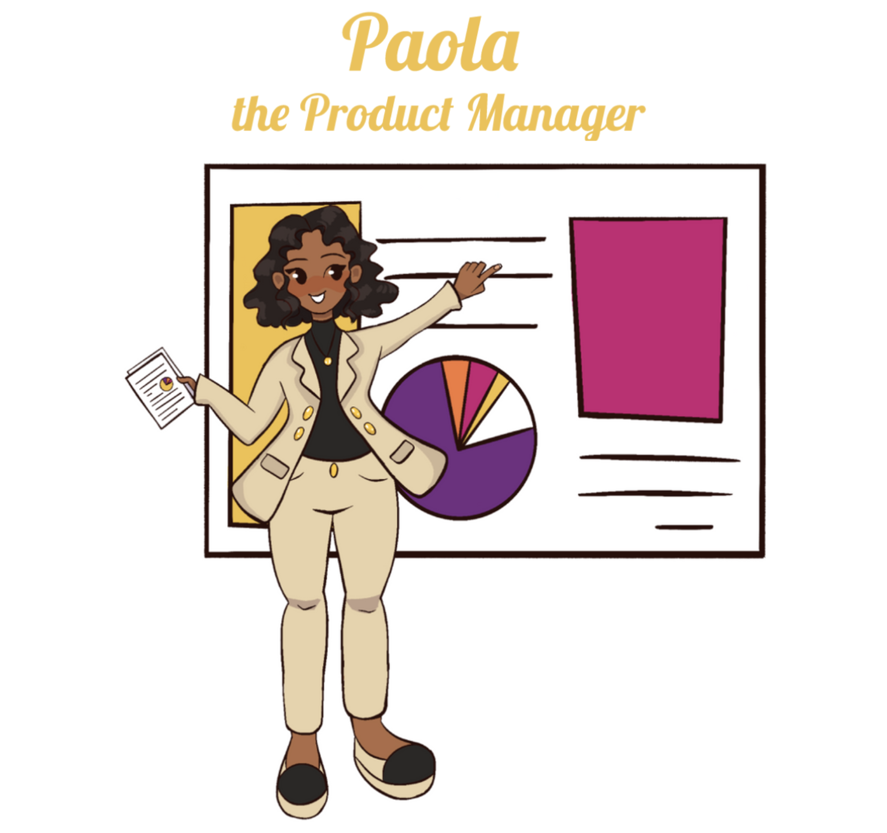

Product Managers drive and lead their team's vision and are experts on the _why_ and _how_ of the product.
They clearly define the problem that the product is solving, and what outcomes and goals need to be reached in order for it to be created. They work closely with teams of designers, engineers, and sometimes researchers, analysts and marketers.




As the Venn Diagram shows, product managements lives at the intersection of Tech, User Experience and Business. The Product Manager must research and become acquainted with the needs of the user, the market, the customer, and the problem they have that you're trying to solve.

They work with lots of information such as client feedback, research reports, market trends, statistics – all to help define the vision of the product and have a roadmap to build it successfully. Great Product Managers are detail-oriented but are also able to see the big picture and prioritize what features are most important when building the product.

## User Stories

A user story is a way to describe a new feature that you would like to build.
It provides a description of the type of person (role) that this feature will
help. It also describes what this role will be able to accomplish and why it's
important that we build it.

A user story helps capture the user's voice and point of view.
It helps define the _who_, _what_ and _why_ of a new feature.

The typical template is as follows:

> As a [role],
> I want to [do something]
> so that I can [achieve a goal].


This templates is useful to help start a conversation about a new feature idea
that you might have. In this course, we will create [new issues][issue] to record our
feature ideas. Then we can add comments to the issue to share wireframes or
discuss possible engineering challenges for building that feature.

When building software we might come up with many different ideas for different
features. Some of these ideas might be related to each other. Some of them might
be harder to build than other ones. Some of them might be more useful than
others. By arranging our new ideas using the User Story template, we can quickly
decide which features to build first and which ones to build later. We might
decide to break up a large feature into smaller ones.

When Engineers start building the feature. They need a way to know if they've
built it correctly so that they will know when it is done. To communicate this
information with Engineers, a Product Manager may also include __Acceptance Criteria__,
to list out what things must be included in the final build in order
for us to claim that we've completed the feature.

__Acceptance Criteria__ are usually listed as bullet points and should be
easy to measure. This helps to provide a definition for "done" so that the team
can ensure that they are building the features in the correct way.

Examples:


```plaintext
===============================================================================
As a Teacher,
I want to know why my students need help,
so that I can provide them with the assistance that they need.

Acceptance Criteria:

* The teacher must be notified when the student needs help.
* The teacher must have a way to set up a 1:1 session with the student.
* The student must provide a description of what they need help with.
...
===============================================================================
As a Student,
I want to Sparkle one of my classmates,
so that they can feel appreciated.

Acceptance Criteria:

* A sparkle must have a recipient.
* A sparkle must have a reason.
* The reason must be greater than 5 characters in length.
* The reason must be less than 255 characters in length.
* The recipient of the Sparkle must receive a notification.
...
===============================================================================
```

[issue]: https://github.com/CodeChica/SparkleHub/issues/new
